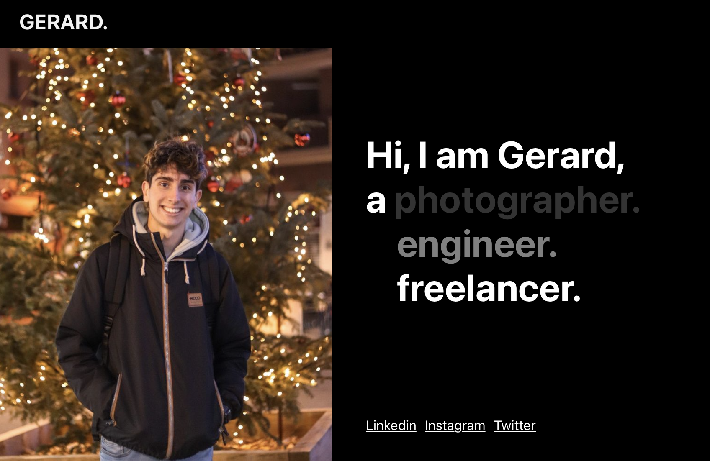

# Gerard Sáez Sánchez CV

## Target user profile
The final user is interested in my services. The CV webpage has to attract him/her.

## Information Architecture
Single-page project. With header with navigation bar, some sections and pictures in between. Contact form and footer at the end.

## Visual design
An attractive contrast between black and white colors. All in a modern easy-to-read font.
Here's my Figma proposal:
http://bit.do/gerardcvfigmaproposal

## Development
Requirement: [**Node.js**](https://nodejs.org/)
1. Install dependencies `npm install`
2. Run dev server `npm run dev`
3. Open `http://localhost:3000/`

I tried so hard to publish it to Github pages but no efforts have been enough to make it work. A white page displays:
https://mynameg3rard.github.io

Instead, please install Node or have a look at the attached ".webarchive" document.

Made by Gerard Sáez Sánchez